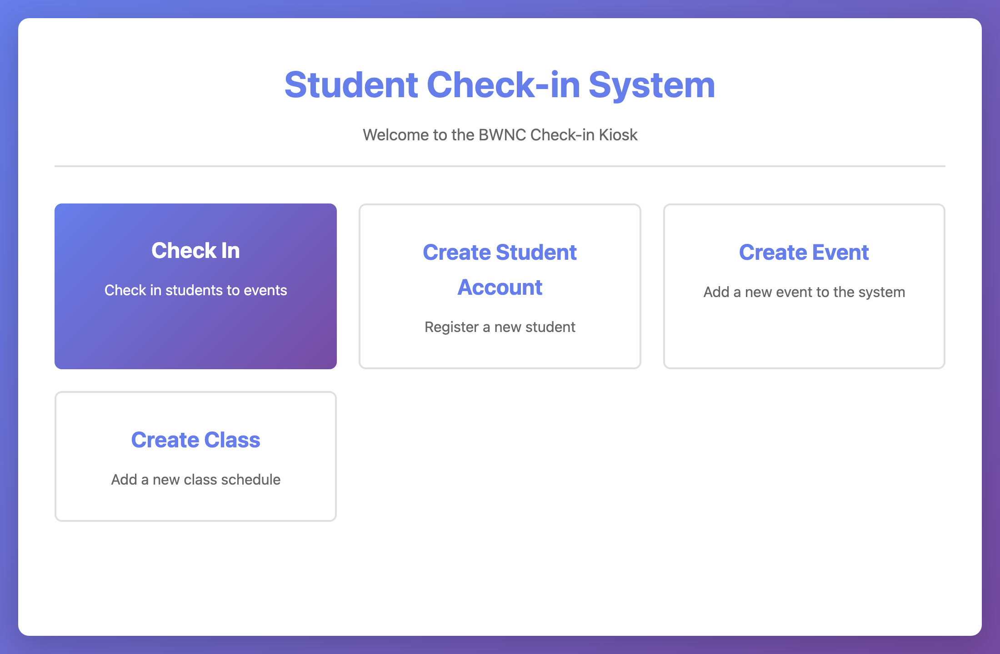

# bwnc-checkin-system

Kiosk-based student check-in web app. A single Go binary serves a JSON API at `/api/*` and the static frontend (`web/static/`) from `/`. Postgres for storage — no build step on the frontend.



## Quick start

You'll need [Go 1.25+](https://go.dev/dl/) and [Docker](https://docs.docker.com/get-docker/) (for Postgres). That's it — no Node, no frontend build.

Use **two terminals**: one runs the server, the other loads the example data.

**Terminal 1 — start Postgres and the server:**

```bash
# 1. Start Postgres
docker-compose up -d postgres

# 2. Create your local env file from the template (defaults match docker-compose)
cp .env.example .env

# 3. Run the server — loads .env, creates the tables (migrations), listens on :8090
go run cmd/server/main.go
```

Leave that running. On first start it creates all the tables.

**Terminal 2 — load the example data:**

```bash
./seed.sh
```

Now open <http://localhost:8090> and click **Check In** — you'll see seeded events in the picker and can search for a student (try typing `al` for Alice) to check them in. See [what the example data contains](#example-data) below.

> First time hitting a wall? Jump to [Troubleshooting](#troubleshooting).

## Example data

`./seed.sh` loads `seed.sql` so the UI has something to show on a fresh database. It's **safe to re-run** — every statement is idempotent (`ON CONFLICT` / `WHERE NOT EXISTS`), so it never duplicates, deletes, or resets anything.

What you get:

| Entity     | Count | Notes                                                                                  |
|------------|-------|----------------------------------------------------------------------------------------|
| Classes    | 5     | e.g. *Beginner Yoga*, *Advanced Piano*; three have a student leader                    |
| Students   | 10    | Most linked to a class; one (*Jordan Smith*) has no class, to exercise that path       |
| Events     | 5     | Two in the past (with attendance), three upcoming — **dated relative to today** so they always appear in the kiosk's recent-events picker |
| Check-ins  | 9     | Attendance recorded against the two past events                                        |

Because events are dated relative to *now*, the kiosk's default picker (which shows events from the last 6 months onward) will always include them no matter when you seed.

`seed.sh` uses a local `psql` if you have one; otherwise it runs `psql` **inside the Postgres container**, so you don't need a Postgres client installed on your laptop. It reads connection details from `.env`.

> The example data is purely for local development and demos — `seed.sql` lives outside the migration runner, so it never touches a real deployment.

## Browsing the database

`docker-compose.yml` includes an [Adminer](https://www.adminer.org/) container for ad-hoc SQL and table browsing.

```bash
docker-compose up -d adminer
```

Then open <http://localhost:8080> and log in with:

| Field    | Value                |
|----------|----------------------|
| System   | PostgreSQL           |
| Server   | `checkin-postgres`   |
| Username | `checkin_user`       |
| Password | `checkin_pass`       |
| Database | `checkin_db`         |

(`Server` is the Postgres container name on the docker network, not `localhost` — Adminer connects from inside the docker network.) Default credentials match `docker-compose.yml`; if you've overridden them, use yours.

## Configuration

Set in `.env` (see `.env.example` for the full template):

| Var           | Required | Notes                                       |
|---------------|----------|---------------------------------------------|
| `DB_HOST`     | yes      |                                             |
| `DB_PORT`     | yes      |                                             |
| `DB_USER`     | yes      |                                             |
| `DB_PASSWORD` | yes      |                                             |
| `DB_NAME`     | yes      |                                             |
| `DB_SSLMODE`  | yes      | `disable` for local                         |
| `SERVER_PORT` | no       | Currently ignored — port is hard-coded to `:8090` in `cmd/server/main.go` |

## API

All JSON. All under `/api/*`.

| Method | Path                       | Description                                    |
|--------|----------------------------|------------------------------------------------|
| GET    | `/health`                  | Liveness + DB connectivity                     |
| POST   | `/api/students`            | Create student                                 |
| GET    | `/api/students/search?q=`  | Search by first/last name                      |
| POST   | `/api/classes`             | Create class (`class_name` is required + unique)|
| GET    | `/api/classes`             | List classes                                   |
| GET    | `/api/classes/search?q=`   | Search classes by name/day/time                |
| GET    | `/api/classes/{id}`        | Get class (with leader info if set)            |
| PUT    | `/api/classes/{id}`        | Update class                                   |
| DELETE | `/api/classes/{id}`        | Delete class                                   |
| POST   | `/api/events`              | Create event                                   |
| GET    | `/api/events`              | List all events                                |
| GET    | `/api/events/recent`       | Events from the last 6 months on (kiosk picker)|
| POST   | `/api/checkins`            | Record a check-in (rejects duplicates with 409)|
| GET    | `/api/checkins?event_id=`  | List check-ins for an event (`event_id` required)|

A class leader is referenced by `student_id` (a leader is also a student).

Quick smoke test once the server is running:

```bash
curl -s localhost:8090/health
curl -s "localhost:8090/api/events/recent" | jq .
curl -s "localhost:8090/api/students/search?q=al" | jq .
```

## Project layout

```
cmd/server/main.go         # entry point: env → logger → DB → migrations → router
internal/
├── db/                    # Postgres connection + retry/pool
├── migration/             # forward-only migration runner (homegrown)
├── models/                # Student, Class, Event, Checkin
├── validation/            # Sanitize* + Validate* helpers (unit-tested)
├── repository/            # interface + Postgres impl per entity
├── handlers/              # HTTP layer + business logic (no service layer)
├── router/                # chi router + requestLogger middleware
└── logger/                # stdlib log + lumberjack rotation
migrations/                # 001_…sql, 002_…sql — applied lexicographically on start
web/static/                # plain HTML/JS/CSS, no build step
seed.sql / seed.sh         # idempotent example data for local dev (see above)
test_api.sh                # end-to-end API smoke test
docs/images/               # screenshots used in this README
```

## Testing

```bash
./run_tests.sh           # Go unit tests (validation + handlers), with coverage
./test_api.sh            # end-to-end API smoke test — requires the server running on :8090
```

`test_api.sh` creates its own throwaway records (uniquely suffixed per run, so it's re-runnable) and is independent of the seed data. See `TESTING.md` for conventions and what each layer covers.

## Troubleshooting

| Symptom | Fix |
|---------|-----|
| `Cannot connect to the Docker daemon` | Start Docker Desktop (or your Docker engine) and re-run `docker-compose up -d postgres`. |
| Server exits with `Missing required database configuration` | You skipped `cp .env.example .env`, or the DB isn't up yet. Check `docker ps` shows `checkin-postgres`. |
| `./seed.sh` says it can't reach Postgres | Start the database first: `docker-compose up -d postgres`. |
| Seeded data, but the check-in picker is empty | The server must have started at least once so the tables exist before seeding. Start it, then run `./seed.sh`, then refresh. |
| `port already in use` on `:8090` | Another instance is running. Stop it, or free the port. The port is hard-coded in `cmd/server/main.go`. |
| Want a clean slate | `docker-compose down -v` removes the Postgres volume; the next server start recreates the schema, then re-run `./seed.sh`. |

## Further reading

- `CLAUDE.md` — rules and orientation for AI agents working in this repo
- `ARCHITECTURE_SIMPLIFIED.md` — why there's no service layer
- `LOGGING.md` — logger usage and gotchas
- `CHANGELOG.md` — notable changes
